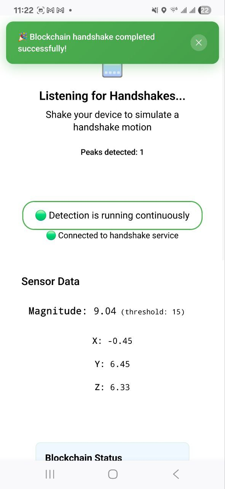
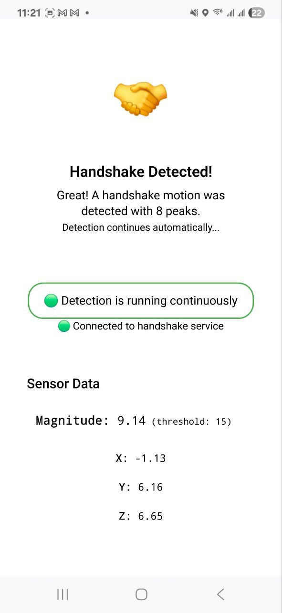
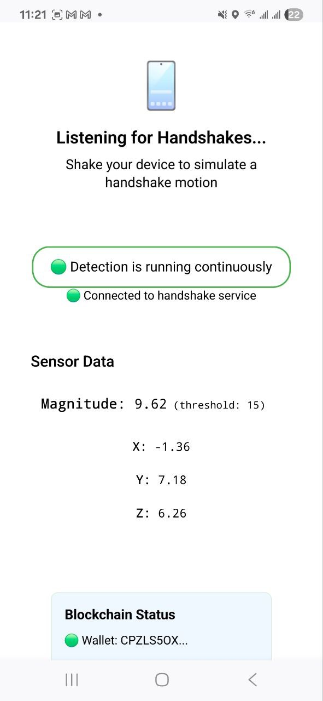
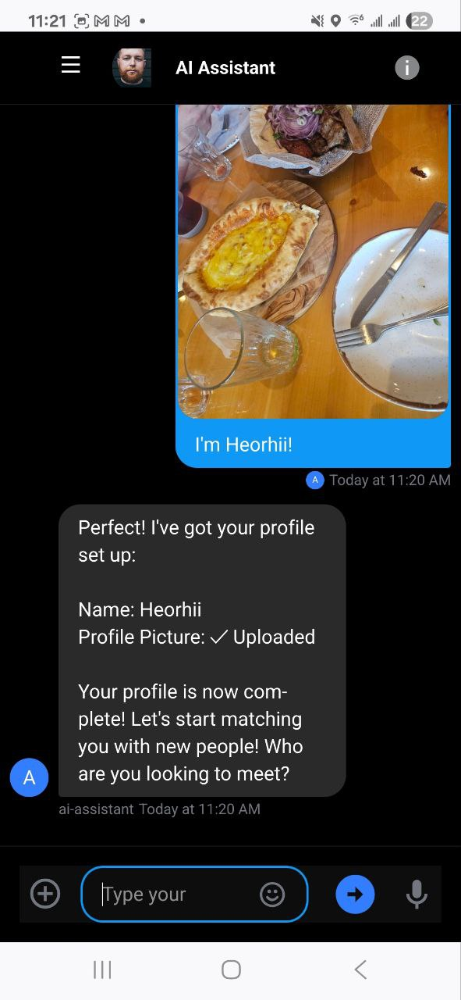
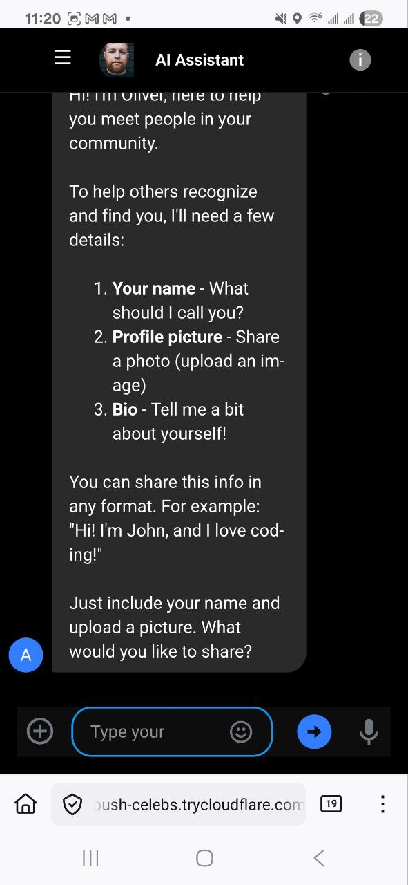
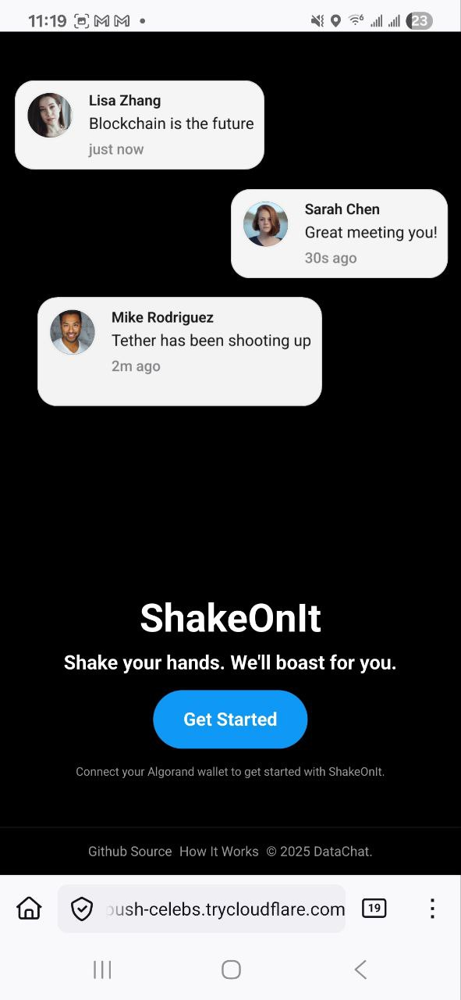

# Demo Video
[Link](https://www.youtube.com)

# Screenshots

# Inner Workings Video
[Link](https://youtu.be/noPm6m9mNHc)

# Backend
[Link to repo](https://github.com/AnmayG/datachat-api)

# Getting Started

This project was bootstrapped with [Create React App](https://github.com/facebook/create-react-app).\
The main purpose of this demo is to showcase how Stream's React SDK can be used for building Social Messenger kind of applications.

# Development process

1. Clone this repository
2. `cd social-messenger-ts && yarn install`
3. Copy the `.env-example` file into `.env.development` file and fill in the details
4. `yarn start`

# Release process

Current release process is quite manual. Until we automate it, please follow the following procedure for creating a build and a deployment to the production environment.\
**Note**: This demo is currently hosted on Github Pages.

1. Clean the working directory of your current branch
   1. You can `git stash` your current work-in-progress
2. Copy the `.env-example` file into `.env.production` and fill in just the following parameter:
   1. `REACT_APP_STREAM_KEY=dz5f4d5kzrue`
3. `cd .. && yarn build:sm`
   1. This command will create a production optimized bundle and will copy it to the `/docs/social-messenger` directory
   2. Please make sure to smoke-test the demo locally before proceeding with the next step
4. Commit the changes (minified bundle) to your branch and open a PR towards `master`
5. Once your PR is merged, Github will automatically initiate the deployment process to Github Pages.
6. Once the deployment process is finished, you can see your changes live on the [main website](https://getstream.io/chat/demos/messaging/).

## Available Scripts

In the project directory, you can run:

### `yarn start`

Runs the app in the development mode.\
Open [http://localhost:3000](http://localhost:3000) to view it in the browser.

The page will reload if you make edits.\
You will also see any lint errors in the console.

### `yarn test`

Launches the test runner in the interactive watch mode.\
See the section about [running tests](https://facebook.github.io/create-react-app/docs/running-tests) for more information.

### `yarn build`

Builds the app for production to the `build` folder.\
It correctly bundles React in production mode and optimizes the build for the best performance.

The build is minified and the filenames include the hashes.\
Your app is ready to be deployed!

See the section about [deployment](https://facebook.github.io/create-react-app/docs/deployment) for more information.

### `yarn eject`

**Note: this is a one-way operation. Once you `eject`, you can’t go back!**

If you aren’t satisfied with the build tool and configuration choices, you can `eject` at any time. This command will remove the single build dependency from your project.

Instead, it will copy all the configuration files and the transitive dependencies (webpack, Babel, ESLint, etc) right into your project so you have full control over them. All of the commands except `eject` will still work, but they will point to the copied scripts so you can tweak them. At this point you’re on your own.

You don’t have to ever use `eject`. The curated feature set is suitable for small and middle deployments, and you shouldn’t feel obligated to use this feature. However we understand that this tool wouldn’t be useful if you couldn’t customize it when you are ready for it.

## Learn More

You can learn more in the [Create React App documentation](https://facebook.github.io/create-react-app/docs/getting-started).

To learn React, check out the [React documentation](https://reactjs.org/).
